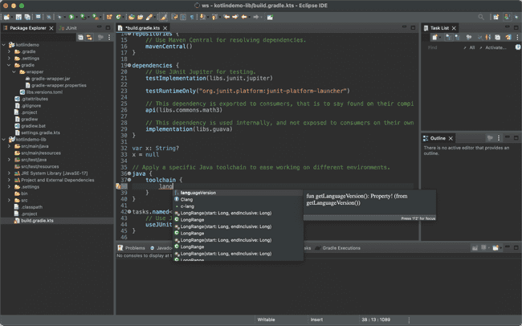

[Google Summer of Code (GSoC)](https://summerofcode.withgoogle.com/) is a global,
online program focused on bringing new contributors into open source software development.
GSoC Contributors work with an open source organization on a 12+ week programming project
under the guidance of mentors.
Gradle has participated in GSoC since 2023.

## GSoC 2024

Many organizations, including the Kotlin Foundation and the Eclipse Foundation, are planning Google Summer of Code in 2024.
In Gradle, we plan to join one of the existing organizations.
Let us know in the `#gsoc` channel on the community Slack if you're potentially interested!

### Project Ideas

So far we have submitted the relevant project ideas as a part of two foundations:

- [Kotlin DSL improvements for Declarative Gradle](https://kotlinlang.org/docs/gsoc-2024.html#kotlin-dsl-improvements-for-declarative-gradle-medium-175-hrs) -
  Kotlin Foundation, Medium difficulty, 175 hrs
- [Gradle build server – support for Android projects](https://kotlinlang.org/docs/gsoc-2024.html#gradle-build-server-support-for-android-projects-medium-or-hard-175-hrs-or-350-hrs) -
  Kotlin Foundation, Medium or Hard difficulty, 175 hrs or 350 hrs
- [Kotlin DSL documentation samples test framework](https://kotlinlang.org/docs/gsoc-2024.html#kotlin-dsl-documentation-samples-test-framework-easy-or-medium-90-hrs-or-175-hrs) -
  Kotlin Foundation, Easy or Medium difficulty, 90 hrs or 175 hrs
- [Improve Buildship project and classpath generation](https://gitlab.eclipse.org/eclipsefdn/emo-team/gsoc-at-the-ef/-/issues/7) -
  Eclipse Foundation, Easy difficulty, 175 hrs or 350 hrs
- [Make Buildship independent from the Eclipse Gradle plugin](https://gitlab.eclipse.org/eclipsefdn/emo-team/gsoc-at-the-ef/-/issues/6) -
  Eclipse Foundation, Medium or Hard difficulty, 175 hrs or 350 hrs
- [Eclipse and Gradle Build Server](https://gitlab.eclipse.org/eclipsefdn/emo-team/gsoc-at-the-ef/-/issues/5) -
  Eclipse Foundation, Medium or Hard difficulty, 175 hrs or 350 hrs

### For Contributors/Mentees

See the project descriptions for references to particular newcomer-friendly issues or
learning scenarios.
If nothing is available there, it is recommended to start learning Gradle basics, if you aren't already familiar with them.
Then, we recommend looking into some of the newcomer-friendly issues in the target project or in Gradle as whole.
Prior track of contributions during the application phase is important during the project proposal reviews,
because it helps us to build impression about the candidate.

To get started:

1. Join the `#gsoc` channel on the Gradle community Slack.
  If there're such channels in the foundations, please join them too
2. Explore the [Getting Started with Gradle](https://docs.gradle.org/current/userguide/getting_started_eng.html) with Gradle and the relevant [topic-specific Gradle Guides](https://gradle.org/guides/)
3. Check out the [contributing guidelines](../../contributing/README.md), try addressing some of the newcomer friendly issues
4. Discuss the project ideas with your mentors on the public channels

References:

- [Official GSoC website](https://summerofcode.withgoogle.com/) -
  all official guidelines are here. Please refer there about eligibility, stipend, and other similar matters managed by Google during the GSoC program
- [Best practices for GSoC contributors](https://www.jenkins.io/projects/gsoc/students/),
  by the Jenkins community - we will be using a similar framework

### For Mentors

We invite Gradle community members, if they are interested in mentoring, to submit their project ideas.

Mentoring requires a time commitment of several hours a week.
It is a great opportunity to have someone prototyping your idea
that it is not on the short term roadmap
but remains interesting to you and valuable to the Gradle community.

References:

- [GSoC website](https://summerofcode.withgoogle.com/)
- [Jenkins mentor guide](https://www.jenkins.io/projects/gsoc/mentors/) -
  Realistic expectations from mentors which we maintain in the Jenkins project
- [Mentorship Programs. Growing new community leaders](https://speakerdeck.com/onenashev/mentorship-programs-growing-new-team-and-community-leaders) -
  a presentation by Oleg Nenashev on mentorship programs

## GSoC 2023

In the summer of 2023, The Kotlin Foundation sponsored four projects for the Google Summer of Code 2023.
The Gradle Kotlin Script Support for Eclipse and BuildShip project by [Nikolai Vladimirov](https://www.linkedin.com/in/vladimir0v/) was one of them!
Gradle, a Kotlin Foundation member, and [Donát Csikós](https://github.com/donat) provided mentoring support for this project.

The project's initial goal was to improve user interaction with Gradle Kotlin scripts inside the Eclipse IDE.
The project aimed to implement several key functionalities, including syntax highlighting for Kotlin scripts, content assistance, go-to-definition, accurate diagnostics for syntax errors, signature help, and hovering.
Nikolai successfully delivered these features by implementing support for Kotlin scripts based on the existing [kotlin-language-server](https://github.com/fwcd/kotlin-language-server) project,
creating a new system to separate compilation environments for each build script.
[Read more](https://kotlinfoundation.org/news/gsoc-2023-eclipse-gradle-kotlin/) about this project by Nikolai and the team.

